# TrustDraw

A protocol for dealing and playing with a shuffled deck of cards in the open, using RSA, AES and Ed25519 encryption.

This protocol does not currently support returning cards to the deck, but will be extended to support it. It will require a further call to the dealer.

## Try it out

```sh
# Install the TrustDraw CLI
$ go install github.com/jphastings/trustdraw@latest
go: downloading github.com/jphastings/trustdraw v1.0.0

# Deal a deck to play with
$ trustdraw deal standard52-fr test_data/dealer.pem test_data/player1.pub.pem test_data/player2.pub.pem > example.deal

# Verify that the deck was created by the dealer to prevent cheating
$ trustdraw verify example.deal test_data/dealer.pub.pem
✅ example.deal is a valid deck of 52 cards for 2 players

# As Player 2, get an allowKey, to allow Player 1 to draw a card
$ trustdraw allow-draw example.deal test_data/player2.pem 1
Creating example-game.player2.state to hold game state…
Your allowKey: BABFpJBzhiVJwMonZIDVDjk4

# As Player 1, use the allowKey given by Player 2 to draw a card
$ trustdraw draw example.deal test_data/player1.pem BABFpJBzhiVJwMonZIDVDjk4
Creating example-game.player1.state to hold game state…
You drew: 3♦️
Prove with: AACH+oA5nhR+JoulasCyHrmv

# As Player 2, when Player 1 plays 🃓, verify that they really drew that card
$ trustdraw verify-draw example.deal test_data/player2.pem 🃓 AACH+oA5nhR+JoulasCyHrmv
✅ This was a valid draw

# Demonstrate that a cheating draw is detectable
$ trustdraw verify-draw example.deal test_data/player2.pem 🂱 AACH+oA5nhR+JoulasCyHrmv
❌ This was not a valid draw
```

## Protocol

Below is a walk-through of the deal and a draw of a two player game of Scrabble using this protocol. This also works for more players.

```mermaid
sequenceDiagram
    participant A as Alice
    participant B as Bob
    participant D as Dealer

    A->>D: Share public key, Tileset to use
    activate D
    B->>D: Share public key
    Note over D: Shuffles tiles & publishes Deal file
    deactivate D

    D->>B: Retrieve Deal file
    activate B
    B-->>B: Validate Deal file
    deactivate B
    D->>A: Retrieve Deal file
    activate A
    A-->>A: Validate Deal file
    deactivate A

    activate B
    Note over B: Allow 8 draws by Alice<br/>(Record first 8 tiles as Alice's)
    B->>A: 8× allowKeys for Alice
    deactivate B
    
    activate A
    Note over A: Draw 8 tiles with provided allowKeys<br/>(Record first 8 tiles as Alice's)
    Note over A: Allow 8 draws by Bob<br/>(Record tiles 9-16 as Bob's)
    A->>B: 8× allowKeys for Bob
    deactivate A

    loop Until game has winner
        activate B
        Note over B: Draw 8 tiles with provided allowKeys<br/>(Record tiles 9-16 as Bob's)
        Note over B: Decide on play<br/>eg. JOKED 8D 50
        B->>A: Scrabble notation for the play<br/>Bob's  allowKeys for each tile used
        deactivate B
        
        activate A
        Note over A: Validate Bob's turn:<br/>Do given allowKeys decrpt used tiles?<br/>Are used tiles recorded as Bob's?
        Note over A: Allow 5 replacement draws by Bob<br/>(Record tiles 17-21 as Bob's)
        Note over A: Decide on play<br/>eg. REV(O)TInG E5 94
        A->>B: Scrabble notation for move<br/>Alice's allowKeys for each tile used<br/>5× allowKeys for Bob
        deactivate A
    end
```



To **deal the tiles**:

1. Both players send their public RSA keys to the dealer.
2. Dealer generates 100 AES keys for Alice, and 100 for Bob. (As English Scrabble has 100 tiles)
3. Dealer pairs off the keys made for Alice and Bob, and XORs them to make 100 combined keys.
4. Dealer pairs off each of the (shuffled) cards ("E(1)", "J(8)", "S(1)", etc) with each of the combined keys, and symmetrically encrypts the card with the key — this is the "shuffled deck". _(`AES-128-GCM`)_
5. Dealer encrypts all Alice's keys (in order, the "key stack"), for Alice's eyes only, using Alice's public RSA key. _(`AES-128-CTR` preceeded by `RSA(key)`)_
6. …and does the same for Bob.
7. Dealer publishes the shuffled deck and these two encrypted blocks, all signed with a dealer's key (`Ed25519`), to demonstrate authenticity, as the "deal file".

To **verify a deal**:

1. The contents of the deal file are compared with the provided signature

To **allow a tile draw**, to **draw a tile**, to **play a tile**, and to **verify a drawn tile**:

1. Alice and Bob both independently retrieve & decrypted the deal file with their private keys
2. Allowing a draw:
   1. Bob finds the top-most unused AES key from their key stack (recording it as "dealt to Alice") and shares it, combined with the tile number in the deck, with Alice as an "allowKey".
3. Drawing a tile:
   1. Alice breaks apart the allowKey into the tile number, and Bob's AES key for it.
   2. Alice finds the AES key for that tile from their own key stack, recording it as used by themselves.
   3. Alice XORs their key and the one received from Bob to make the combined key.
   4. Alice uses this combined key to decrypt the relevant card from the "shuffled deck", and now has drawn a tile!
4. Playing a tile:
   1. Alice shares the tile as part of play, sharing _their_ associated allowKey along side it, for validation.
5. Verifying a drawn tile:
   1. Bob breaks apart the allowKey provided by Alice during the play into a tile number, and Alice's AES key for it.
   2. Bob ensures that the tile number is recorded as having been given to Alice.
   3. Bob XORs their key and the one received from Alice to make the combined key.
   4. Bob uses this combined key to decrypt the relevant tile from the "shuffled deck"
   5. Bob knows the play was legitimate if the locally decrypted tile is the same as the one played by Alice.
